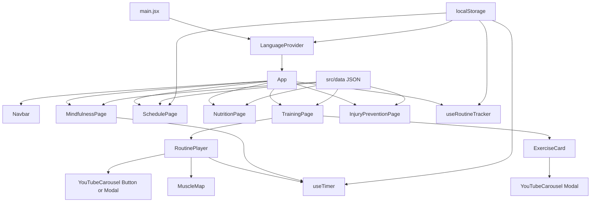

# FitFit.pro — Application Architecture

This document describes the current technical structure of the app and how core modules interact.

## 1) High-Level Overview

FitFit.pro is a React + Vite single-page app organized around 5 feature tabs:

- Training
- Schedule
- Nutrition
- Mindfulness
- Recovery

Primary characteristics:

- Static JSON-driven content
- Local-first persistence (no backend)
- Bilingual UI (English/Spanish)
- Modal video guidance based on exercise name mapping

## 2) Runtime Composition

```text
main.jsx
  -> LanguageProvider
    -> App
      -> Navbar + Active Tab Page + Footer
```

`App` controls tab switching and routes UI by conditionally rendering page components.

## 2.1) Architecture Flow (Mermaid)



## 3) Current Project Structure

```text
fitfit.pro/
├── docs/
│   ├── ARCHITECTURE.md
│   └── COMPONENTS.md
├── scripts/
│   └── fetchVideos.cjs
├── src/
│   ├── App.jsx
│   ├── App.css
│   ├── index.css
│   ├── main.jsx
│   ├── components/
│   │   ├── Navbar.jsx
│   │   ├── SoundSettings.jsx
│   │   ├── Training/
│   │   │   ├── TrainingPage.jsx
│   │   │   ├── RoutinePlayer.jsx
│   │   │   ├── ExerciseCard.jsx
│   │   │   ├── EquipmentFilter.jsx
│   │   │   ├── MuscleMap.jsx
│   │   │   └── YouTubeCarousel.jsx
│   │   ├── Schedule/SchedulePage.jsx
│   │   ├── Nutrition/NutritionPage.jsx
│   │   ├── Mindfulness/MindfulnessPage.jsx
│   │   └── InjuryPrevention/InjuryPreventionPage.jsx
│   ├── data/
│   │   ├── exercises.json
│   │   ├── predefinedRoutines.json
│   │   ├── exerciseVideos.json
│   │   ├── schedule.json
│   │   ├── mealPlan.json
│   │   ├── recipes.json
│   │   ├── mindfulnessProgram.json
│   │   ├── mindfulness.json
│   │   └── injuryPrevention.json
│   ├── hooks/
│   │   ├── useRoutineTracker.js
│   │   └── useTimer.js
│   ├── i18n/
│   │   ├── LanguageContext.jsx
│   │   ├── en.json
│   │   └── es.json
│   └── utils/
│       ├── storage.js
│       └── audio.js
├── index.html
├── package.json
└── vite.config.js
```

## 4) Feature Architecture

### Training Domain

`TrainingPage` is the largest orchestration component and contains:

- **Predefined view**
  - Goal Plan (today + quick routines + week plan)
  - Workout Library (generated prebuilt packs + basic config)
- **Custom Builder view**
  - Equipment filtering
  - Category and glutes tabs
  - Selectable exercise cards
- **Library view**
  - Browse-only exercise catalog with counters

When the user starts a routine, flow moves into `RoutinePlayer`.

### Routine Execution

`RoutinePlayer` handles:

- Current exercise, set completion, and progression
- Rest state integration with `useTimer`
- Drag-and-drop queue reordering
- In-context video opening per queue item
- Session completion callback to tracker

### Video Guidance

`YouTubeCarousel` resolves 3 video types per exercise:

1. Form Tutorial
2. Aux / Technique
3. Common Mistakes

Resolution strategy:

- Try direct ID from `exerciseVideos.json`
- Fallback to YouTube search embed URL

Modal usage modes:

- Embedded as button-triggered modal
- Direct modal mode (`asModal`) for card/queue interactions

## 5) Data and State Flow

### State Layers

- **Component local state (`useState`)**
  - view modes, selected filters, modal visibility, player queue state
- **Feature hooks**
  - `useTimer`: countdown behavior
  - `useRoutineTracker`: workouts and progression logging
- **Context**
  - `LanguageContext` (`lang`, `setLang`, `t`)
- **Persistence (`localStorage`)**
  - language, progression, workout logs, sound settings

### Content Sources

All user-facing plan content is JSON-based under [src/data](../src/data):

- exercise catalogs
- routine templates
- nutrition plans
- mindfulness program
- recovery content

## 6) Styling System

Styling is centralized in:

- [src/index.css](../src/index.css): global tokens, base styles
- [src/App.css](../src/App.css): feature/component styles

Design approach:

- CSS custom properties for theme consistency
- reusable utility-like class patterns (`card`, `tag`, button variants)
- responsive breakpoints for mobile/tablet/desktop layouts

## 7) Internationalization

i18n uses [src/i18n/LanguageContext.jsx](../src/i18n/LanguageContext.jsx) plus:

- [src/i18n/en.json](../src/i18n/en.json)
- [src/i18n/es.json](../src/i18n/es.json)

Guidelines:

- UI labels should use `t('...')`
- Data objects can include bilingual inline fields where needed

## 8) Operational Notes

### Build

- Dev: `npm run dev`
- Prod build: `npm run build`
- Preview: `npm run preview`

### Video Mapping Maintenance

The script [scripts/fetchVideos.cjs](../scripts/fetchVideos.cjs) is used to populate/update [src/data/exerciseVideos.json](../src/data/exerciseVideos.json) with direct YouTube IDs.

## 9) Extension Points

Recommended next-safe expansion points:

- Add new workout pack templates in `TrainingPage` generator logic
- Expand `exerciseVideos.json` labels if new video categories are needed
- Add analytics on routine completion via `useRoutineTracker`
- Move large generated pack logic to a dedicated `utils/workoutPacks` module if complexity grows
