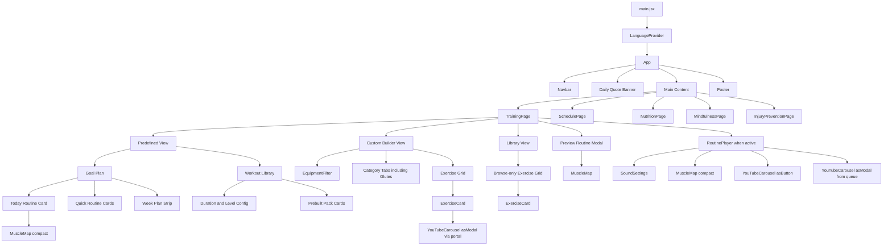

# FitFit.pro — Component Tree (Current)

This document describes the live component hierarchy and the role of each main component.

## Root Tree

```text
main.jsx
└─ <LanguageProvider>
   └─ <App>
      ├─ <Navbar>
      ├─ Daily Quote Banner
      ├─ <main>
      │  ├─ <TrainingPage>              (tab: training)
      │  │  ├─ Predefined View
      │  │  │  ├─ Goal Plan sub-tab
      │  │  │  │  ├─ Today Routine card
      │  │  │  │  │  └─ <MuscleMap compact>
      │  │  │  │  ├─ Quick Routine cards
      │  │  │  │  └─ Week Plan strip
      │  │  │  └─ Workout Library sub-tab
      │  │  │     ├─ Duration + Level config controls
      │  │  │     └─ Prebuilt pack cards (playable)
      │  │  ├─ Custom Builder View
      │  │  │  ├─ <EquipmentFilter>
      │  │  │  ├─ Category tabs (incl. Glutes)
      │  │  │  └─ Exercise Grid
      │  │  │     └─ <ExerciseCard>
      │  │  │        └─ <YouTubeCarousel asModal> (via portal)
      │  │  ├─ Library View (browse-only)
      │  │  │  └─ Exercise Grid
      │  │  │     └─ <ExerciseCard>
      │  │  ├─ Preview Routine Modal
      │  │  │  └─ <MuscleMap>
      │  │  └─ <RoutinePlayer>          (when workout is active)
      │  │     ├─ <SoundSettings>
      │  │     ├─ <MuscleMap compact>
      │  │     ├─ <YouTubeCarousel asButton>
      │  │     └─ <YouTubeCarousel asModal> (queue item click)
      │  ├─ <SchedulePage>              (tab: schedule)
      │  ├─ <NutritionPage>             (tab: nutrition)
      │  ├─ <MindfulnessPage>           (tab: mindfulness)
      │  └─ <InjuryPreventionPage>      (tab: recovery)
      └─ Footer
```

## Component Tree (Mermaid)



## Core Components

### App Layer

- `App` ([src/App.jsx](../src/App.jsx))
  - Owns `activeTab`
  - Builds tab config from i18n labels
  - Injects `tracker` into training/schedule
  - Shows daily quote from `t('quotes')`

- `Navbar` ([src/components/Navbar.jsx](../src/components/Navbar.jsx))
  - Tab navigation
  - Language toggle (`en` / `es`)

### Training Stack

- `TrainingPage` ([src/components/Training/TrainingPage.jsx](../src/components/Training/TrainingPage.jsx))
  - Three top-level views: `predefined`, `custom`, `library`
  - Predefined has two sub-tabs: `goal` and `workout library`
  - Uses local data composition to build prebuilt workout packs
  - Starts workout by passing selected exercise list into `RoutinePlayer`

- `RoutinePlayer` ([src/components/Training/RoutinePlayer.jsx](../src/components/Training/RoutinePlayer.jsx))
  - Active session executor
  - Manual timer + rest timer handling
  - Queue supports drag-and-drop reorder
  - Queue item click opens modal videos for that exercise

- `ExerciseCard` ([src/components/Training/ExerciseCard.jsx](../src/components/Training/ExerciseCard.jsx))
  - Card display for one exercise
  - Selection behavior in custom view
  - Video button opens modal through `createPortal(document.body)`

- `YouTubeCarousel` ([src/components/Training/YouTubeCarousel.jsx](../src/components/Training/YouTubeCarousel.jsx))
  - Three slots only:
    - `formTutorial`
    - `techniqueTips`
    - `commonMistakes`
  - Reads `exerciseVideos.json` first, falls back to YouTube search embeds
  - Supports three render modes:
    - `asButton`
    - `asModal`
    - legacy card mode

- `MuscleMap` ([src/components/Training/MuscleMap.jsx](../src/components/Training/MuscleMap.jsx))
  - SVG front/back body map
  - Highlights muscles by input list

- `EquipmentFilter` ([src/components/Training/EquipmentFilter.jsx](../src/components/Training/EquipmentFilter.jsx))
  - Equipment chips
  - Multi-select filter callback

### Cross-Cutting UI

- `SoundSettings` ([src/components/SoundSettings.jsx](../src/components/SoundSettings.jsx))
  - Pack selection + volume slider
  - Uses audio utilities and local storage settings

## Hooks and Context

- `LanguageProvider` / `useLanguage` ([src/i18n/LanguageContext.jsx](../src/i18n/LanguageContext.jsx))
  - Translation lookup `t(path)`
  - language state and persistence

- `useRoutineTracker` ([src/hooks/useRoutineTracker.js](../src/hooks/useRoutineTracker.js))
  - workout log and stats persistence

- `useTimer` ([src/hooks/useTimer.js](../src/hooks/useTimer.js))
  - countdown and control helpers for workout/mindfulness timers

## Data-Coupled Components

- Training: `exercises.json`, `predefinedRoutines.json`, `exerciseVideos.json`
- Schedule: `schedule.json`, plus routine references
- Nutrition: `mealPlan.json`, `recipes.json`
- Mindfulness: `mindfulnessProgram.json`
- Recovery: `injuryPrevention.json`
